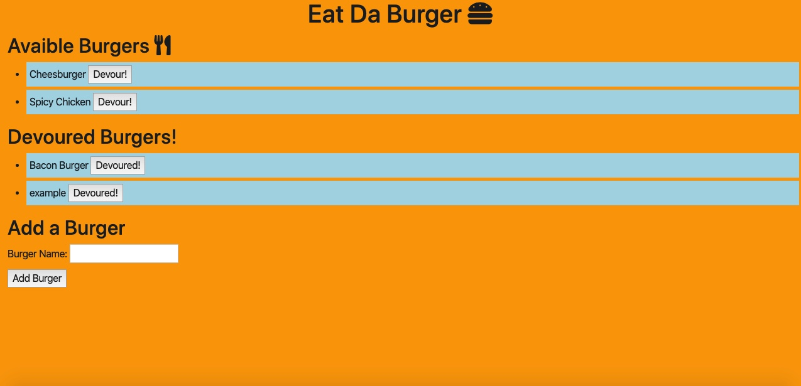

# Burger App
## Description: 
This application allows users to save burgers they'd like to eat and then "DEVOUR!" them! Using MySQL and JawsDB to save userinput.
## Table Of Contents:
* How To Install
* Usage
* Technology Used/Badges
* Contributors
* Tests
* GitHub
## How To Install: 
All you need is a web browser!
## Usage:
Simply add the burger you'd like to eat into the text box and click the "Add Burger" button. Then once you're ready to eat it, click the "Devour" button. 

## Technologies Used/Bagdes: 
     
## Lisence:  
MIT
## Contributors:
Edwin Genova
## Tests:
None
## GitHub: 

